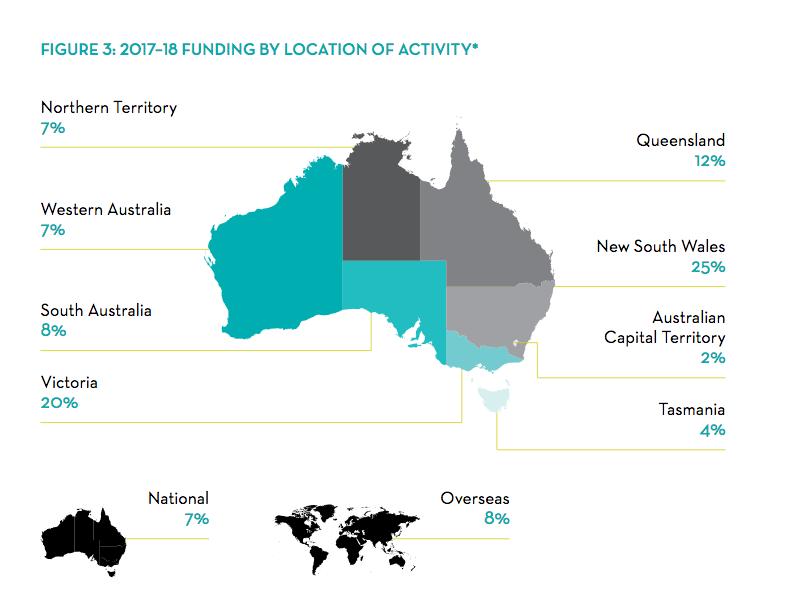

## I am born

The day of my birth (the 25^th^ of January, 1882) was a dark cold day, as the poet later said of the day of Yeat's death[^fn1] -- not that one should practice a belief in omens. Just drink lots of H~2~O instead.

<span class="sans">This is sans text</span>

<span class="smallcaps">This is smallcaps text</span>

<span style="font-variant:small-caps;">This is also small caps using 'style=font-variant:small-caps', instead of the `smallcaps` class</span>

<span class="centred">This is centred text</span>

<span class="right-aligned">This is right-aligned text</span>

This paragraph includes a footnote reference that doesn't have a definition: here.[^fn2]

Here is some text with an interesting set of quotations: 'I remember the '70s, even if most of 'em don't,' said Jack. 'You can sort of see how the zeitgeist --- to use a fancy word *auf deutsch* --- militated against the conditions of memory. Rock 'n' roll, personal liberty... you know how it was.'

'Well,' I said, 'I don't really. I wasn't born.'

'Birth isn't anymore than an imagined event!'

His claims, I would later reflect, were indicative, even if I would have been pressed to say exactly of what.

* * *

I would later read, in Halsey's *In Memoriam*, the following claim, which I will give after a lot of **arrant nonsense** in order to make indentation and size changes, if any, a little clearer. A feature of a great deal of prose is repetition. A feature of a great deal of prose is repetition. A feature of a great deal of prose is repetition. A feature of a great deal of prose is repetition.

> People will just make up quotes nowadays, just to see what happens.
> I myself have seen this in
>   1. A university textbook
>   2. A popular novel
>
> What should we make of this?

A feature of a great deal of prose is repetition. A feature of a great deal of prose is repetition. A feature of a great deal of prose is repetition. A feature of a great deal of prose is repetition. A feature of a great deal of prose is repetition. A feature of a great deal of prose is repetition.
The following deals with varieties of quotes:

> This should be a quote

And then, remembering as we do always, A feature of a great deal of prose is repetition. A feature of a great deal of prose is repetition. A feature of a great deal of prose is repetition. A feature of a great deal of prose is repetition. A feature of a great deal of prose is repetition. A feature of a great deal of prose is repetition. A feature of a great deal of prose is repetition. A feature of a great deal of prose is repetition.

> This should be a quotation, since it has not only this first paragraph
>
> But this second one!

This paragraph contains a soft
And a hard  
Break. A feature of a great deal of prose is repetition. A feature of a great deal of prose is repetition. A feature of a great deal of prose is repetition. A feature of a great deal of prose is repetition. A feature of a great deal of prose is repetition. A feature of a great deal of prose is repetition. A feature of a great deal of prose is repetition.

Now a rule:

* * *

This paragraph contains arbitrary html <a href="http://www.example.com">(A link)</a>

### A subheading with *emphasis* (the 1^st^ of its kind)

```python
print("Hello world")
print('Hopefully these quotes aren\'t curly!')
```

The above is an example of block code, but inline code is also possible: ```print('Hello world')```.

1. A numbered list
2. With two items

* An itemised list
* With two items

This is ~~easy~~ more difficult than it looks, maybe. [Google](http://www.google.com) for help.

The image below could be helpful, too:



## [1^st^ Example](http://example.com)

This chapter's title contains a link (which will have been necessarily removed), as well as some interesting details like superscript. A multi-para footnote follows.[^fn3]

[^fn1]: Auden, 'In Memoriam W.B. Yeats'.

[^fn3]:    Here we *go*, more pseudo-erudition -- can't you give it a rest?
	'No, sir, I must check quotations.'
	'This is not the 16^th^ of August, nor the 1^st^ of September.'